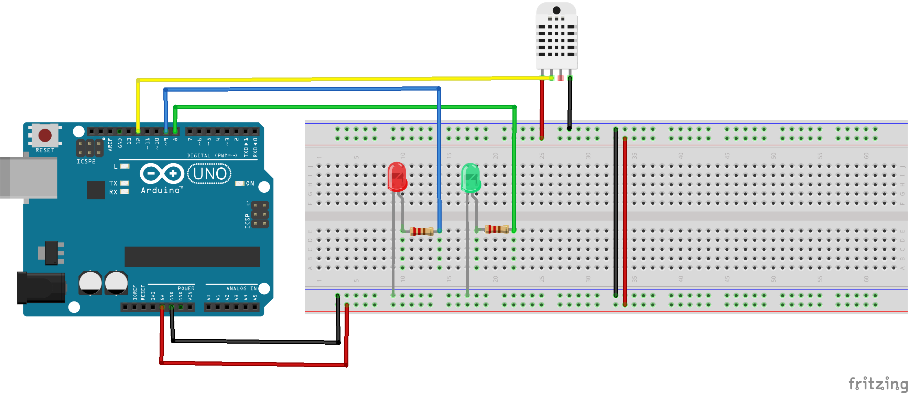

# DHT22-LED

Arduino sketch to check the Temperature and Humidity and switch on or off the two green and red leds. Works with DHT11 also.

<strong>Short Description:</strong>

Booting with the green led on, if the temperature goes above 26c then the red led lights on and the green goes off

 <strong>Instructions: </strong>

Connect the pins accordingly and install the <a href="https://github.com/adafruit/DHT-sensor-library">DHT-sensor-library</a>

